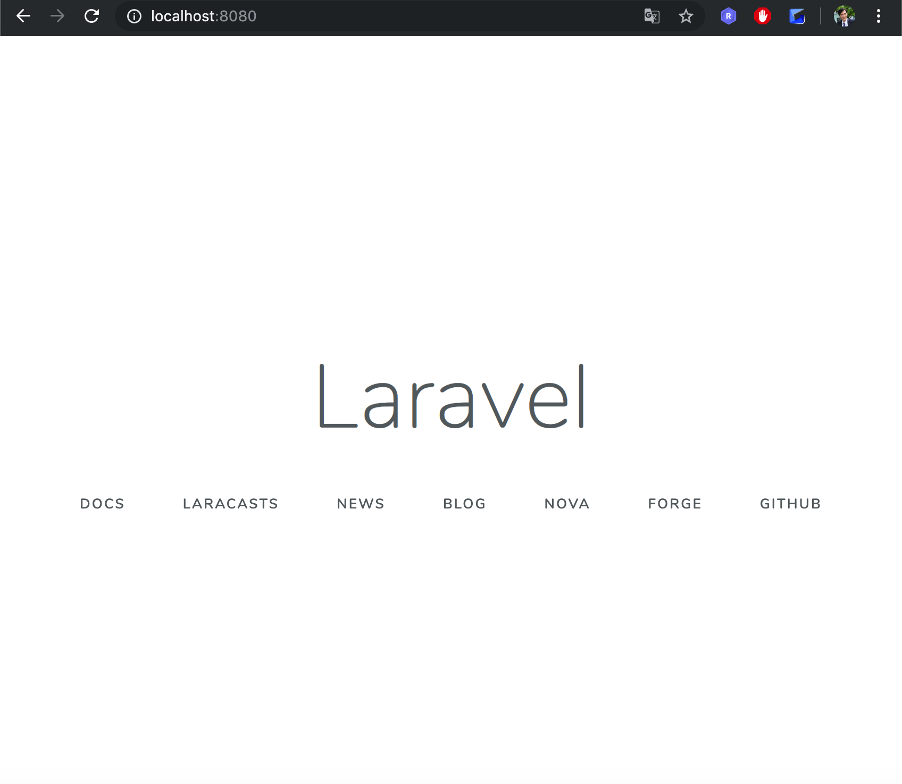
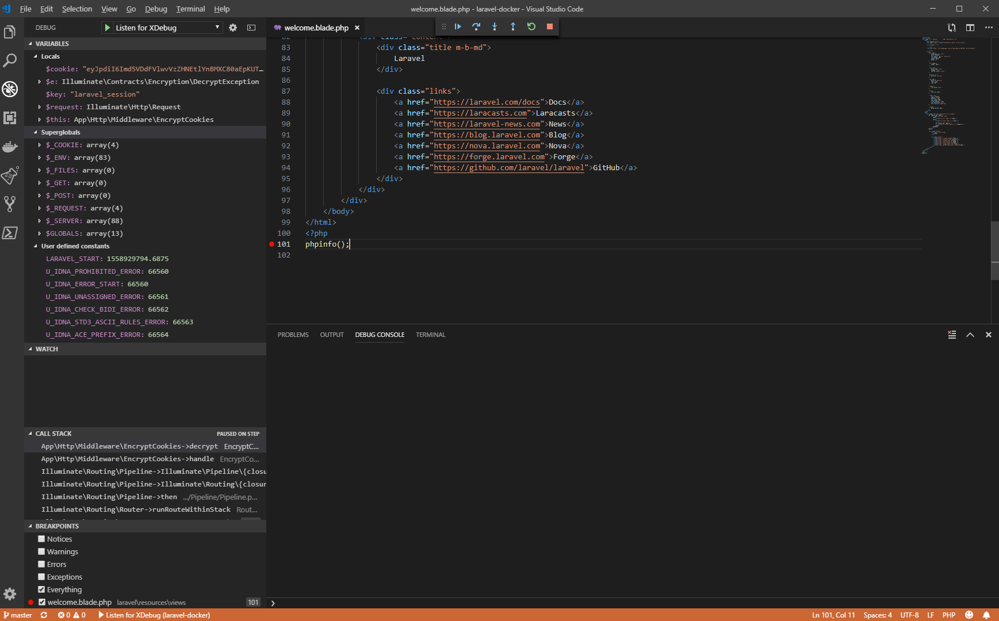

# TL;DR

```
hexaforce:~ relics9$ docker version
Client: Docker Engine - Community
 Version:           18.09.2

hexaforce:~ relics9$ docker-compose version
docker-compose version 1.23.2, build 1110ad01

hexaforce:~ relics9$ php -v
PHP 7.3.5 (cli) (built: May  2 2019 12:40:36) ( NTS )

hexaforce:~ relics9$ composer -v
Composer version 1.8.4 2019-02-11 10:52:10

hexaforce:~ relics9$ laravel -v
Laravel Installer 2.1.0
```

## procedure
```

git clone git@github.com:hexaforce/laravel-docker.git

cd laravel-docker

#### New creaate Laravel application
laravel new laravel
cat .env.docker > ./laravel/.env

cd laravel

composer install
php artisan key:generate

#### Or your Laravel repository
# git submodule add https://github.com/<your>/<laravel-repository>.git laravel

cd ..

docker-compose up 

```

## look up

http://localhost:8080/

  

## php debugging
 

## redis gui

* Redis Commander  
http://localhost:8081/  

## windows 
It may not work with docker for windows.Please refer to the following.  
https://forums.docker.com/t/volume-mounts-in-windows-does-not-work/10693
Installing [Cygwin](https://www.cygwin.com/) may help.  

